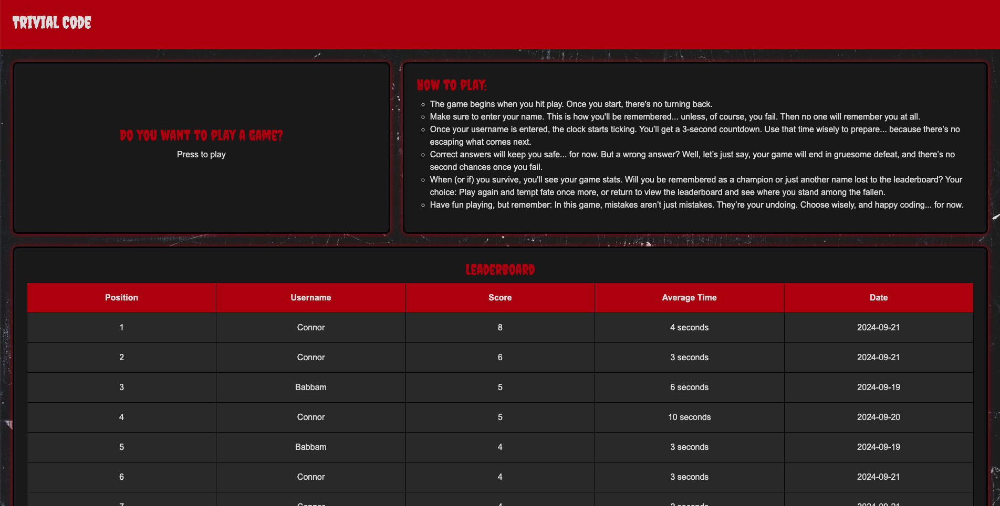
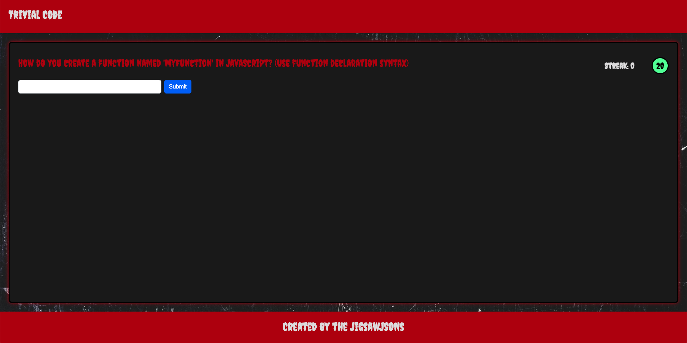

# Trivial Code

## Description

This trivia game is an interactive web application that tests the user's coding knowledge through a series of multiple-choice and short-answer questions. Built using HTML, CSS, JavaScript, and Bootstrap, the game provides users with a fun way to reinforce coding concepts across various topics. The game features a landing page with instructions on how to play, a leaderboard of stats pulled from local storage, and a button linked to the trivia game. The trivia game first asks the user for their username and then begins a countdown timer to build excitement. The game includes score tracking, instant feedback on user responses, sound effects, and a question clock to display how much time remains to answer the question.

### Motivation

Our motivation for creating Trivial Code was to develop an entertaining platform that helps users practice and reinforce coding concepts in a fun, high-stakes environment. We wanted to make learning code exciting by introducing suspenseful elements inspired by horror themes like the movie Jigsaw.

### Why We Built This Project

We built this project to provide coding learners and enthusiasts with a way to test their knowledge under pressure. By combining education with a thrilling game experience, we hope to enhance learning retention and make studying coding concepts more enjoyable.

### Problem It Solves

Traditional methods of studying coding concepts can be monotonous and lack engagement. Trivial Code addresses this by turning learning into an interactive game that motivates users through excitement and competition. It helps users reinforce their coding knowledge while enjoying a suspenseful gaming experience.

### What We Learned

Throughout the development of Trivial Code, we learned valuable skills in web development, including responsive design using Bootstrap, client-side storage with local storage, and dynamic user interaction with JavaScript. We also gained experience in team collaboration, Git workflow, and integrating elements like sound effects and animations to enhance user engagement.

## Table of Contents

-- [Installation](#installation)

-- [Usage](#usage)

-- [Credits](#credits)

-- [Features](#features)

## Installation

No installation is required to play Trivial Code. The game is hosted online and can be accessed directly through your web browser by following the url https://connorldailey.github.io/Trivial-Code/index.html. However, if you would like to install and run Trivial Code locally on your machine, follow these steps:

1. Clone the Repository: `git clone git@github.com:Connorldailey/Trivial-Code.git`.
2. Open the project directory: `cd Trivial-Code`.
3. Open the web application (Open the index.html file in your browser).

No additional installations are required since the game is built with front-end technologies and runs entirely in the browser.

## Usage

1. **Access the Game**

   - Open your web browser and navigate to the following URL:

     [**https://connorldailey.github.io/Trivial-Code/**](https://connorldailey.github.io/Trivial-Code/)

2. **Understand the Game**

   - On the landing page, read the instructions to familiarize yourself with the game mechanics.

3. **Start Playing**

   - Click on the **"Play Game"** button.
   - Enter your username when prompted.
   - A countdown timer will begin before the first question appears.

4. **Answer Questions**

   - You will be presented with randomly selected multiple-choice or short-answer questions.
     - **Multiple-choice questions:** You have **10 seconds** to select the correct answer.
     - **Short-answer questions:** You have **30 seconds** to type and submit your answer.
   - Immediate feedback will be given after each response.

5. **Game Over**

   - The game ends when you answer a question incorrectly or run out of time.
   - Your stats, including your score and the number of questions answered, will be displayed.
   - If your score is among the top 10, it will be saved to the leaderboard.

6. **Post-Game Options**

   - Choose to **Play Again** or **Return Home** from the game over screen.

**Landing Page Example**

**Trivia Page Example**

## Credits

- **Team Members**

  - [Connor Dailey](https://github.com/Connorldailey)
  - [Luke Washington](https://github.com/LWashington6935)
  - [Russell Keown](https://github.com/rlkeown)
  - [Amer Osman](https://github.com/amerosmanbootcamp)

- **Third-Party Assets**

  - **Bootstrap**: Used for responsive design and styling components. [Bootstrap Documentation](https://getbootstrap.com/)
  - **Sound Effects**: Sourced from [FreeSound](https://freesound.org/) to enhance the horror theme.

- **Tutorials and Resources**

  - [MDN Web Docs](https://developer.mozilla.org/): Referenced for JavaScript and web API documentation.
  - [W3Schools](https://www.w3schools.com/): Consulted for HTML, CSS, and JavaScript examples and explanations.

## Features

- **Horror-Themed Design**
  - Graphics and sound effects inspired by *Jigsaw* to create a suspenseful gaming experience.

- **Randomized Questions**
  - A mix of multiple-choice and short-answer questions covering coding topics to keep gameplay fun and challenging.

- **Time Constraints**
  - Countdown timers for each question type to add pressure and excitement.

- **Score Tracking and Leaderboard**
  - Tracks user scores and displays the top 10 scores on the leaderboard, encouraging competition and self improvement.

- **Instant Feedback**
  - Provides immediate feedback on user responses to promote learning.

- **Local Storage Integration**
  - Utilizes local storage to save high scores and user info.

- **Replayability**
  - Option to play again or return to the homepage after each game session.
